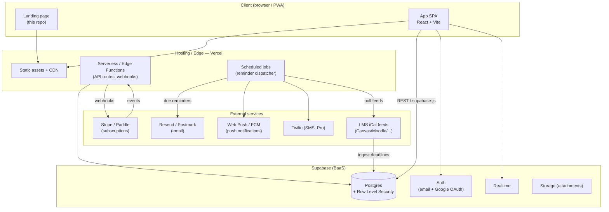
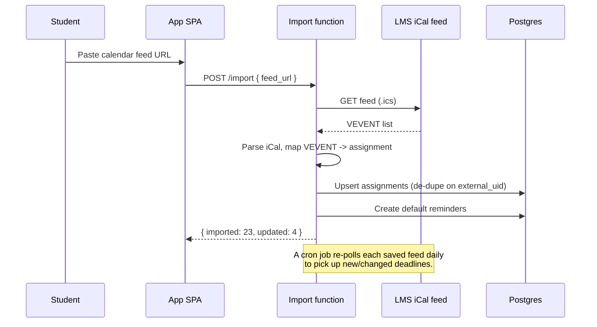
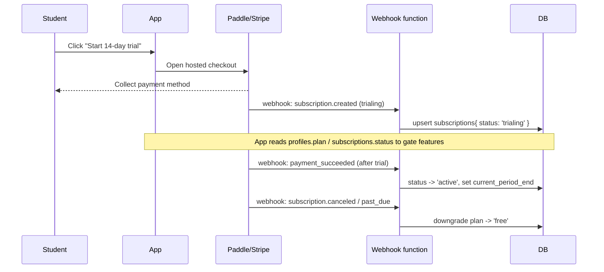

# DeadlineMate — End-to-End Architecture

> The blueprint for turning the DeadlineMate landing page into a real, paid product used
> by students worldwide. This document covers the system design, data model, reminder
> engine, auth, payments, deployment, and a phased build plan.

---

## 1. What we are building

**Problem:** Students miss assignment deadlines because dates live across LMS portals,
emails, and memory — and nothing reminds them in time.

**Product:** A calm web app (mobile-first) where a student's every assignment, exam, and
reminder lives in one place, ranked by urgency, with reliable notifications so nothing
slips.

**The two features that make it spread:**
1. **LMS calendar import** — paste a Canvas/Moodle/Blackboard/Google Classroom calendar
   link and every deadline auto-syncs. (Removes manual data entry, the #1 reason these
   apps get abandoned.)
2. **Shared class deadlines** — one student adds a deadline, classmates subscribe. Viral,
   organic growth.

---

## 2. System overview



**Design principle:** a solo founder must be able to run this. We lean on a
backend-as-a-service (Supabase) and managed providers so there are no servers to babysit.

---

## 3. Tech stack

| Layer | Choice | Why |
|---|---|---|
| Frontend (marketing) | React 19 + Vite + Tailwind v4 + Framer Motion | Already built (this repo). |
| Frontend (app) | Same stack, separate route/bundle + React Router | One toolchain to learn. |
| State/data fetching | TanStack Query + `supabase-js` | Caching, optimistic updates. |
| Auth | Supabase Auth (email magic link + Google OAuth) | Students love "Sign in with Google". |
| Database | Supabase Postgres + Row Level Security | Relational data + per-user isolation in the DB. |
| Backend logic | Vercel serverless/edge functions | Webhooks, secure operations, third-party calls. |
| Scheduled jobs | Supabase Cron (pg_cron) **or** Vercel Cron | Drives the reminder engine + LMS polling. |
| Email | Resend (or Postmark) | Simple API, great deliverability. |
| Push | Web Push (VAPID) + FCM for native later | Free, works on modern browsers. |
| SMS (Pro tier) | Twilio | High-urgency alerts. |
| Payments | Stripe — or Paddle/Lemon Squeezy for global tax | Paddle = merchant of record, handles VAT worldwide. |
| Hosting | Vercel | Static + functions + cron in one place. Replaces GitHub Pages (no backend there). |
| Analytics | PostHog (product) + Plausible (privacy-friendly web) | Funnels + retention. |
| Error tracking | Sentry | Catch production bugs. |

---

## 4. Repository structure (target monorepo)

```
deadlinemate/
├── apps/
│   ├── web/                 # marketing landing page (this repo today)
│   └── app/                 # the product SPA  (/app)
├── packages/
│   ├── ui/                  # shared design system (buttons, cards, tokens)
│   ├── db/                  # schema, migrations, typed client
│   └── lib/                 # shared logic (urgency scoring, date utils, iCal parser)
├── supabase/
│   ├── migrations/          # SQL migrations
│   └── functions/           # edge functions (reminders, webhooks, import)
└── ARCHITECTURE.md
```

> Start simpler: keep the landing page as-is, add an `/app` route, and only split into a
> monorepo once it's warranted. Don't over-engineer before there are users.

---

## 5. Data model

Core tables (Postgres). All user-owned tables are protected by **Row Level Security** so a
user can only ever read/write their own rows.

```sql
-- Users are managed by Supabase Auth (auth.users). We mirror profile data here.
create table profiles (
  id            uuid primary key references auth.users on delete cascade,
  display_name  text,
  timezone      text not null default 'UTC',     -- critical for global reminders
  plan          text not null default 'free',    -- 'free' | 'pro' | 'campus'
  created_at    timestamptz not null default now()
);

create table courses (              -- a.k.a. modules
  id         uuid primary key default gen_random_uuid(),
  user_id    uuid not null references auth.users on delete cascade,
  name       text not null,
  color      text,
  created_at timestamptz not null default now()
);

create table assignments (
  id            uuid primary key default gen_random_uuid(),
  user_id       uuid not null references auth.users on delete cascade,
  course_id     uuid references courses on delete set null,
  title         text not null,
  notes         text,
  due_at        timestamptz not null,            -- always stored in UTC
  type          text not null default 'assignment', -- 'assignment'|'exam'|'quiz'
  status        text not null default 'todo',    -- 'todo'|'in_progress'|'done'
  priority      smallint,                        -- 1-5, user or auto-set
  source        text not null default 'manual',  -- 'manual'|'lms_import'|'shared'
  external_uid  text,                            -- iCal UID for de-dupe on re-import
  created_at    timestamptz not null default now()
);

create table reminders (
  id            uuid primary key default gen_random_uuid(),
  assignment_id uuid not null references assignments on delete cascade,
  user_id       uuid not null references auth.users on delete cascade,
  remind_at     timestamptz not null,            -- absolute UTC time to fire
  channel       text not null,                   -- 'email'|'push'|'sms'
  offset_label  text,                            -- '1w'|'1d'|'3h' (for UI)
  status        text not null default 'pending', -- 'pending'|'sent'|'failed'
  sent_at       timestamptz
);
create index on reminders (status, remind_at);   -- the dispatcher's hot query

create table calendar_imports (     -- LMS / iCal feed subscriptions
  id            uuid primary key default gen_random_uuid(),
  user_id       uuid not null references auth.users on delete cascade,
  feed_url      text not null,
  provider      text,                            -- 'canvas'|'moodle'|'google'|'ics'
  last_synced   timestamptz,
  created_at    timestamptz not null default now()
);

create table push_subscriptions (  -- Web Push endpoints per device
  id         uuid primary key default gen_random_uuid(),
  user_id    uuid not null references auth.users on delete cascade,
  endpoint   text not null,
  keys       jsonb not null,                     -- p256dh + auth
  created_at timestamptz not null default now()
);

create table subscriptions (        -- billing state, mirrored from Stripe/Paddle
  id                  uuid primary key default gen_random_uuid(),
  user_id             uuid not null references auth.users on delete cascade,
  provider_customer   text,
  provider_sub        text,
  plan                text not null,             -- 'pro'
  status              text not null,             -- 'trialing'|'active'|'past_due'|'canceled'
  current_period_end  timestamptz,
  updated_at          timestamptz not null default now()
);
```

**Example RLS policy** (applied to every user-owned table):

```sql
alter table assignments enable row level security;
create policy "owner can do anything"
  on assignments for all
  using (auth.uid() = user_id)
  with check (auth.uid() = user_id);
```

---

## 6. The reminder engine (the core that must never fail)

This is the product's reason to exist. It must be reliable, idempotent, and timezone-correct.

**When an assignment is created/updated:**
1. App computes reminder times from the user's chosen offsets (e.g. 1 week, 1 day, 3 hours
   before `due_at`) and inserts rows into `reminders` with `remind_at` in **UTC**.
2. Offsets are stored per-assignment so the UI can show/edit them.

**The dispatcher (scheduled job, runs every 1–5 minutes):**
```
SELECT * FROM reminders
WHERE status = 'pending' AND remind_at <= now()
ORDER BY remind_at
LIMIT 200;          -- batch
```
For each row:
- Send via its `channel` (email/push/sms) through the provider.
- On success → `status = 'sent', sent_at = now()`.
- On failure → `status = 'failed'` + retry with backoff (or a `failed` queue).
- **Idempotency:** only ever act on `pending` rows; mark `sent` in the same transaction to
  avoid double-sends if a job overlaps.

**Timezone correctness:** store everything in UTC; convert to the user's `profiles.timezone`
only for display and for "send at 8am their time" style reminders.

**Channels:**
- **Email** — Resend, with a templated "Due tomorrow: Research essay" message. Free-tier
  default.
- **Web Push** — VAPID keys; subscriptions in `push_subscriptions`. Works while the browser
  is installed as a PWA. Pro.
- **SMS** — Twilio, Pro only (it costs money per message).

---

## 7. LMS / calendar import flow



- Parse with a maintained iCal library (e.g. `node-ical`).
- De-duplicate using the event's `UID` stored as `assignments.external_uid` so re-imports
  update rather than duplicate.
- A daily cron re-syncs every `calendar_imports` feed.

---

## 8. Auth & access

- **Supabase Auth**: email magic-link + Google OAuth. No passwords to manage initially.
- On first sign-in, a `profiles` row is created (DB trigger on `auth.users`).
- The browser holds a short-lived JWT; `supabase-js` attaches it to every request and RLS
  enforces ownership **in the database** — the security boundary is not the frontend.
- Sensitive operations (billing, sending mail, reading another user's shared class) run in
  serverless functions using the service-role key, never exposed to the client.

---

## 9. Payments & subscription lifecycle

**Model:** freemium. Free forever tier + Pro (£3.49/mo or £29/yr) + Campus (sales-led).

**Recommended provider:** **Paddle** or **Lemon Squeezy** (merchant of record → they handle
global VAT/sales tax, which matters when selling to students worldwide). Stripe is fine if
you'd rather own tax handling.



**Upgrade trigger (conversion strategy):** don't paywall at signup. Show the upgrade prompt
**at the moment of value** — when a free user adds a 2nd reminder to a task or a 2nd
calendar import: *"Want a reminder the day before AND the morning of? That's Pro."* The
14-day trial starts there, overlapping a real moment of need (exam week).

**Feature gating** is read from `subscriptions.status` / `profiles.plan` on both the client
(for UI) and the server (for enforcement).

---

## 10. API surface (illustrative)

Most reads/writes go directly through `supabase-js` + RLS. Serverless functions exist only
for things that must be trusted or hidden:

| Endpoint | Method | Purpose |
|---|---|---|
| `/api/import` | POST | Fetch + parse an LMS/iCal feed, upsert assignments. |
| `/api/reminders/dispatch` | CRON | Send all due reminders (not publicly callable). |
| `/api/sync-feeds` | CRON | Daily re-poll of saved calendar feeds. |
| `/api/billing/checkout` | POST | Create a checkout session. |
| `/api/billing/webhook` | POST | Receive provider events, update `subscriptions`. |
| `/api/push/subscribe` | POST | Store a Web Push subscription. |

---

## 11. Security & privacy

- **RLS on every table** — the database, not the UI, is the access boundary.
- Service-role key only in server functions; never shipped to the browser.
- Verify webhook signatures (Stripe/Paddle) before trusting events.
- Validate and rate-limit the import endpoint (it fetches arbitrary URLs — restrict to
  known LMS hosts / size limits to avoid SSRF and abuse).
- Student data is sensitive: minimal PII, encrypted at rest (Supabase default), clear
  privacy policy, GDPR-friendly data export/delete.
- Secrets in Vercel/Supabase env vars, never committed.

---

## 12. Deployment & CI

- **Hosting:** move from GitHub Pages → **Vercel** (GitHub Pages can't run functions or
  cron). Landing page can stay on Pages short-term, but the app needs Vercel.
- **CI:** GitHub Actions — on PR run `typecheck` + `build` + lint; on merge to `main`
  Vercel auto-deploys with preview URLs per PR.
- **DB migrations:** versioned SQL in `supabase/migrations`, applied via Supabase CLI in CI.
- **Environments:** `preview` (per-branch) and `production`, each with its own Supabase
  project / keys.

**Required environment variables (high level):**
```
VITE_SUPABASE_URL
VITE_SUPABASE_ANON_KEY
SUPABASE_SERVICE_ROLE_KEY      # server only
RESEND_API_KEY                 # server only
VAPID_PUBLIC_KEY / VAPID_PRIVATE_KEY
TWILIO_*                       # Pro SMS
PADDLE_*  or  STRIPE_SECRET_KEY / STRIPE_WEBHOOK_SECRET
```

---

## 13. Phased build plan

| Phase | Goal | Ship |
|---|---|---|
| **0 — now** | Landing page (clean redesign ✅) | Marketing site live. |
| **1 — MVP** | Real product core | Auth, add/list/complete assignments, calendar view, **email reminders** (the bullet-proof core). Deploy on Vercel + Supabase. |
| **2 — Wow** | Painless data entry | **LMS calendar import** + daily re-sync. Web push reminders. |
| **3 — Money** | Monetize | Paddle/Stripe, freemium gating, 14-day trial, value-moment upgrade prompts. |
| **4 — Growth** | Virality + habit | **Shared class deadlines**, referral perks, streaks/analytics. |
| **5 — Scale** | Reach + revenue | Native mobile app (Expo/React Native), AI study planning, institutional ("Campus") sales to student-support services. |

**Rule:** don't build Phase 2+ until ~20–50 real students rely on Phase 1 and complain when
it's down. Reliability of reminders beats every fancy feature.

---

## 14. Cost outlook (early stage)

Most of this runs on free/cheap tiers until you have meaningful usage:
- Supabase free tier → ~$25/mo Pro when you outgrow it.
- Vercel free/hobby → Pro when traffic grows.
- Resend free (3k emails/mo) → paid as volume grows.
- Twilio/SMS is pay-per-use → Pro-tier only, passed through in pricing.
- Paddle/Stripe → % of revenue, no fixed cost.

You can run Phases 0–2 at roughly **$0–25/month** until real traction justifies more.
